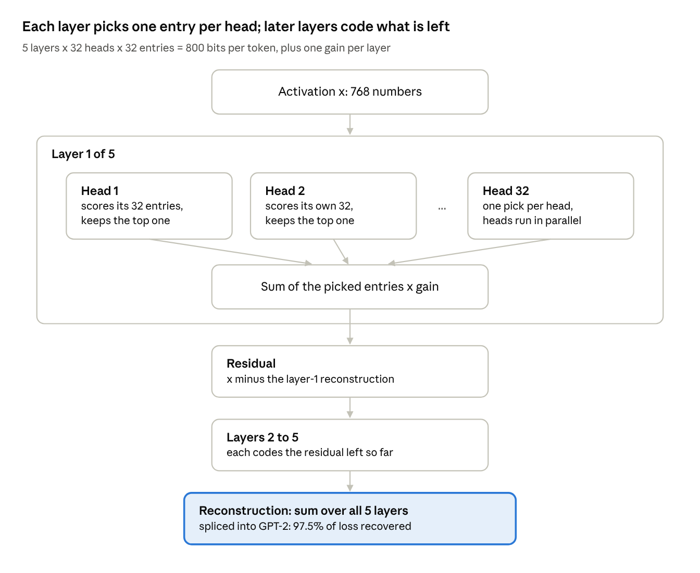

# The Ontologizer: project overview

*Written 2026-10-05 in answer to a reviewer's questions: what the method does, what it's for, what it assumes and why
that's acceptable, how it works intuitively, and how it compares to existing methods (in particular, to existing
steering methods rather than only to SAEs on reconstruction). Numbers are from GPT-2 small, layer 8, held-out data.*

The Ontologizer codes a language model's activations as a few hundred discrete choices per token, so each choice can
be read and swapped. On GPT-2 small it matches a sparse autoencoder on reconstruction. The comparison its steering goal
calls for, against existing steering methods, has not been run; the comparison section says what it should be.

## What the method does
The Ontologizer rewrites a model's activation at one site as a short list of discrete choices, and rebuilds the
activation from them. The current models use 5 layers of 32 heads; each head picks one of 32 learned dictionary entries
(a "label"), so a token is coded by 160 choices, 800 bits, plus one real-valued gain per layer.

On GPT-2 small (the residual stream entering block 8, on FineWeb text), the 40M-token private-heads model (k=32) reconstructs held-out
activations at FVU 0.186. Spliced back into GPT-2 it recovers 97.5% of the next-token loss: replacing the activation with its mean raises
loss by 4.5 nats, and the reconstruction undoes 97.5% of that increase. With k=64 entries per head: FVU 0.164, 97.9%.

Every label is a row of a weight matrix. It can be read, removed, or swapped for another label of the same head, and
that swap is the steering move the design is built around.

## What it's for
The goal is steering vectors without labeled data, discovered together with the contrasts they move between. Today you
get one of two things, and each has a gap.
- **Supervised steering vectors** (contrastive activation addition, mean differences) are cheap and robust, but each
  concept needs a labeled contrastive dataset, and someone has to know the concept exists.
- **Sparse autoencoders** find many features without labels, but as a flat bag of directions. A feature has no stated
  alternatives, features split as dictionaries grow, and adding a feature direction can push activations anywhere.

Each Ontologizer head is a learned classification task over k alternatives. Steering is a swap: "this token sits in
cell a; put it in cell b". The move comes with its contrast class (the other labels of that head), and its result is
always a valid code, so outputs stay bounded. The secondary aim is interpretability by construction: codes should be
causal (the model runs on them), composable (heads combine), and closed (an intervention lands on another valid code).

## What it assumes, and why that is acceptable
| Assumption | Why it is plausible | Evidence (GPT-2 small, layer 8) |
| --- | --- | --- |
| An activation is mostly a sum of a few categorical choices, plus a residual that further layers code | Much of language is categorical: token identity, syntactic role, topic. Residual stacking refines coarse choices, as in residual vector quantization | Held-out FVU 0.186 at 800 bits per token; 97.5% of next-token loss recovered |
| Heads behave as roughly independent factors | Independence is what lets 32 small choices cover 32^32 combinations | Mutual information between two heads' labels: 0.27 bits at layer 0, 0.02 at layer 2, against about 5 bits of label entropy |
| The choices carry the coarse structure; what remains is variation inside a cell | Each label is a prototype; members scatter around it | Adding a rank-4 correction per label on a frozen model cuts FVU from 0.186 to 0.064 |
| The model tolerates running on the code | If it did not, interventions on the code would mean nothing | 97.5% loss recovered; swapping one label costs 0.01 to 0.06 nats of KL |
| Token-level categories exist and can be named | Lexical and predictive classes are well known in language models | Layer-0 cells are predictive token states; an LLM judge picks a cell's top members out of distractors at about 0.91 balanced accuracy (Claude Opus 5.5; typical members: see below) |

Where the assumptions stop:
- **Cells are named from their extremes, not their typical members.** Judged by Claude Opus 5.5, a layer-0 cell's top members are
  picked out at 0.91 balanced accuracy, random members at 0.65 and members near the boundary at 0.55. The gap widens with depth (top
  0.88 and random 0.60 at layer 1; 0.76 and 0.53 at layer 2).
- **How the describer samples matters, a little.** A tagged mix of top, typical and boundary members (8, 32 and 8, each marked with its
  tier) is the best description input for both judges: 0.69 against 0.66 for top members alone with Claude, 0.62 against 0.58 with
  Gemini. Explicit contrast (describing each label against its siblings, or adding non-members) adds nothing with Claude.
- **Deep layers are causal but not yet nameable.** Their labels carry token information and steer specifically, yet layers 3 and 4
  score chance even on their top members, with either judge, and longer contexts (64 tokens around the token) do not help.
- **Only layer 0 reproduces across training seeds.** Deeper label sets differ from run to run.
- **Combinations of cells add little once single cells are described well.** Inside one layer-0 cell, the members another head also
  agrees on form a sub-concept Claude picks out against the rest of that cell at 0.70 to 0.73, against 0.69 to 0.71 for single
  cells and 0.48 to 0.50 for random-partition nulls. With a weaker judge (Gemini) the gap looked larger (0.64 to 0.66 against 0.58).
- **Judging (2026-10-06/07).** An earlier version of this page reported 0.77 to 0.96 for those intersections: the judging agents could
  read the answer keys and earlier answers, and some copied them. Every judge number here comes from clean re-runs. Judging now uses
  Claude Opus 5.5 through plain API calls with no tools, which beats the sandboxed Gemini agent on every set by 0.05 to 0.10.

## How it works, intuitively

(Diagram above: input x → Layer 1 of 5, where heads 1…32 each score their 32 entries and keep the top one, in
parallel → sum of the picked entries × gain → residual = x minus the layer-1 reconstruction → layers 2 to 5, each coding
the residual left so far → reconstruction = sum over all 5 layers, spliced into GPT-2: 97.5% of loss recovered.)

Each head is a small classifier: it scores its 32 entries and keeps the best one. Training is hard in the forward pass
and soft in the backward pass (a straight-through estimator with an annealed temperature). The picked entries are
summed and scaled by a gain, the size of what this layer is explaining. The next layer sees only the residual, so it
codes finer distinctions underneath the coarse ones, as in residual vector quantization. In the private-heads variant
each head writes into its own 48-dimensional block of a shared latent, so heads do not compete for the same directions.

    x̂ = Σ_ℓ g_ℓ Σ_h E_{ℓ,h}[c_{ℓ,h}],   c_{ℓ,h} = argmax_k s_{ℓ,h,k}(r_ℓ),   r_ℓ = x − x̂_{<ℓ}

Steering changes one head's pick at one token, from entry a to entry b. The code stays valid, so the edited activation
stays in the range the model normally sees.

## How it compares to existing methods
The comparison the design calls for, against existing steering methods, has not been run yet. The SAE reconstruction
comparison below is a precondition for steering, not a substitute: steering through a code only means something if the
model's computation runs through that code.

| Method | Needs labeled data? | How it intervenes | Compared so far |
| --- | --- | --- | --- |
| Contrastive activation addition, ActAdd, difference-in-means vectors | Yes: contrastive pairs per concept | Adds a scaled mean-difference vector | Not yet. This is the main comparison owed |
| SAE latent steering | No | Adds or clamps one decoder direction | Ablation cost only, not a matched test: one head set to its mean entry everywhere 0.07 nats KL, one SAE latent removed where active 0.055. Steering not yet |
| AxBench (benchmark of the above, on Gemma 2 2B and 9B) | Varies | LLM-judged concept steering and detection | Not run; the natural venue. It found SAEs not competitive with simple baselines |
| Top-k sparse autoencoders | No | (reconstruction) | Yes, table below |
| Transcoders, Gemma Scope | No | Sparse code of an MLP's input that predicts its output | Designs written; first readouts only |
| Residual and product quantization (RQ-VAE, PQ) | No | Discrete codes built for compression | Closest architectural relatives; not built for intervention, not compared |

What the steering evidence does show is that swaps are specific and cheap against internal controls. Swapping a token's
label a to b moves the model's output toward b's typical output. At unit strength the swap costs 0.01 to 0.06 nats of
KL, and b ranks 1.4 to 4 of 31 alternatives. At four times that strength b still ranks 2 to 6, while a random direction
of the same size ranks 10 to 16. That is specificity, not concept-level success.

The experiment owed, in order:
1. Pick concepts that appear as cells or cell intersections.
2. For each, build a mean-difference vector from labeled pairs, an SAE-latent direction, and the Ontologizer swap.
3. Score concept success with an LLM judge (AxBench's protocol) at matched KL and fluency.
4. Score detection too: cell membership against a linear probe.

AxBench and Gemma Scope 1 target Gemma 2 2B; Gemma Scope 2, which adds transcoders, targets Gemma 3. Which to move to
first is still open.

**Reconstruction, the precondition** (GPT-2 small, layer 8, held-out):

| Model | Training data | Code per token | FVU | Loss recovered |
| --- | --- | --- | --- | --- |
| Ontologizer, private heads, k=64 | 1 pass over 40M tokens | 960 bits + 5 gains | 0.164 | 97.9% |
| Ontologizer, private heads, k=32 | 1 pass over 40M tokens | 800 bits + 5 gains | 0.186 | 97.5% |
| Ontologizer, direct, k=32 | 1 pass over 40M tokens | 800 bits + 5 gains | 0.195 | 97.6% |
| Ontologizer, direct, k=32 | 1 pass over 10M tokens | 800 bits + 5 gains | 0.217 | 97.0% |
| Top-k SAE, 5120 latents, k=128 | 10 passes over 10M tokens | 128 indices + 128 reals | 0.116 | 98.6% |
| Top-k SAE, 5120 latents, k=32 | 10 passes over 10M tokens | 32 indices + 32 reals | 0.189 | 96.2% |

On the same 10M tokens the SAE has lower FVU but recovers less loss, so the Ontologizer's error falls where the model
cares less. Results in the repo's draft paper come from an earlier sentence-embedding setup and are superseded.

## Sources
- Panickssery et al. 2023, [Steering Llama 2 via Contrastive Activation Addition](https://arxiv.org/abs/2312.06681)
- Turner et al. 2023, [Steering Language Models With Activation Engineering](https://arxiv.org/abs/2308.10248) (ActAdd)
- Wu et al. 2025, [AxBench: Steering LLMs? Even Simple Baselines Outperform Sparse Autoencoders](https://arxiv.org/abs/2501.17148)
- Gao et al. 2024, [Scaling and evaluating sparse autoencoders](https://arxiv.org/abs/2406.04093) (top-k SAEs)
- Dunefsky et al. 2024, [Transcoders Find Interpretable LLM Feature Circuits](https://arxiv.org/abs/2406.11944)
- Lieberum et al. 2024, [Gemma Scope: Open Sparse Autoencoders Everywhere All At Once on Gemma 2](https://arxiv.org/abs/2408.05147)
- Lee et al. 2022, [Autoregressive Image Generation using Residual Quantization](https://arxiv.org/abs/2203.01941) (RQ-VAE)
- Product quantization: Jégou, Douze and Schmid 2011, IEEE TPAMI (cited from memory, not opened)
- All GPT-2 numbers: the project's held-out diagnostics (`diag_*.json` per run)
